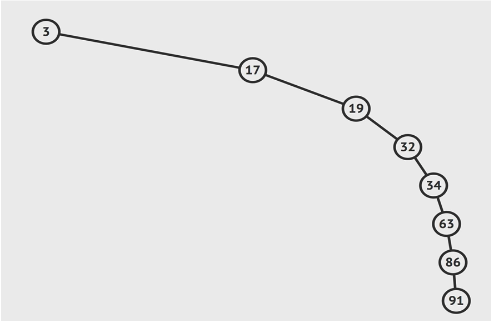

# Binary Search Trees

## Trees
A tree is a Data Structure that consists of nodes in a __parent/child__ relationship  
branching structures that keep splitting

Root points to many nodes, each child node points to from 0 to many other nodes  

trees are __nonlinear__ (as opposed to linked lists that are __linear__)

node can __only point to a child__ - points away from the root(cannot point to parent, sibling, random other node etc)

a __leaf__ is a node without children
an __edge__ is the connection between one node and another (the arrow)

### Used for
- HTML and the DOM 
- Network Routing
- Abstract syntax trees - way of describing the syntax of programming language using tree structure
- Artificial Intelligence (decision tree - ex: can make a tree of all the possible options in a tic tac toe game)
- Computer File System
- JSON

There are many different types of trees
we will focus on binary, more specifically binary search

## Binary Trees
Including the root, each node can only have maximum of 2 nodes

## Binary Search Tree (BST)
used to store data that can be compared, ordered  
If you take any node in the tree (starting at the root),
every node to the left of a parent node is __always less__ than the parent  
every node to the right of a parent node is __always greater__ than the parent

Time Complexity:  
Insertion: __O(log n)__  
Searching: __O(log n)__  

Since they are sorted, each time we search or insert, we go to the left or right and cut out about half the nodes  
As the number of nodes in Binary search tree __doubles__, the number of steps only increases by __1__  
^ this is true for _best_ and _average_ case but  
__THIS IS NOT GUARANTEED__  
Can have a valid BST that is basically a singly linked list (each node only has 1 child node), and would need to visit each node

