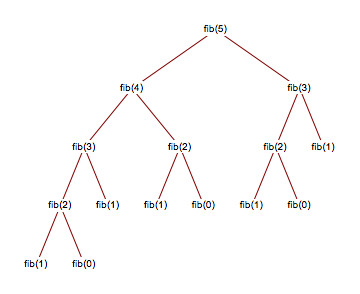
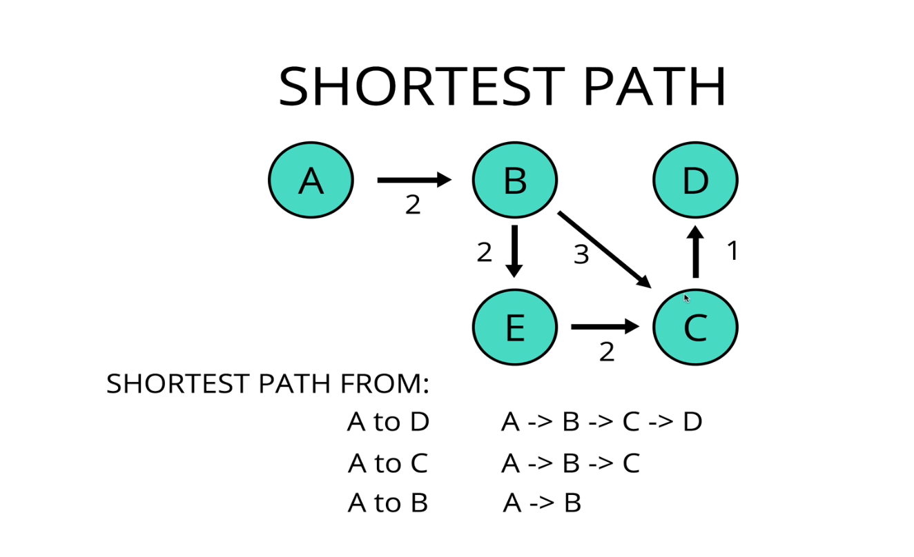

# Dynamic Programming
A method for solving a complex probelm by breaking it down into a collection of simpler subproblems, solving each of the subproblems just once, and storing their solutions (this reduces duplication).  

Using past knowledge to make solving a future problem easier

An approach for solving _some_ problems.  
For those problems that can be solved with __dynamic programming__, it can make a huge difference in their performance.

2 indicators that we can use dynamic programming on a given problem:

- **overlapping subproblems** 

- **optimal substructure**

## Overlapping Subproblems
can break one problem down into subproblems which are reused several times  
For example - fibonacci sequence:

To get `fib(5)`, we need `fib(4)` and `fib(3)` and for `fib(4)` we need `fib(3)` and `fib(2)` etc so that we are calculating the same subproblems multiple times.

MergeSort on the other hand, involves _subproblems_ (breaking a big problem into smaller pieces), but they are not _overlapping_, there is no way to reduce duplication, as we are sorting different pieces of the original array each time.

(A special case would be `mergeSort([10, 24, 10, 24])`, there is overlap, because would split to `[10, 24]`, `[10, 24]`)

## Optimal Substructure
An optimal solution can be constructed from optimal solutions of its subproblems  

For example - fibonacci sequence:
optimal solution of fib(5) depends on best solution of fib(4)and fib(3)  

shortest path between vertices on a graph:  
can construct the optimal solution for shortest path from A -> D from the subproblems and their optimal solutions  
includes the shortest path from A -> C 
and the shortest path from A -> B 

On the other hand, booking cheapest flight would _not_ be optimal substructure.  
If you want to book a flight from SF to Fairbanks, Alaska, the cheapest flight is SF -> Seattle -> Alaska  
If this was a case of optimal substructure, that would mean that the cheapest way to from SF -> Seattle is direct, but it's actually not the cheapest.  
SF -> Portland -> Seattle is the cheapest (because of the way airlines work and incentivize different flights/trips etc).

### Memoization
Storing the results of expensive function calls (usually in arrays or objects) and returning the cached results when the same inputs occur again.

The way we have solved fibonacci until now (using recursion) has _terrible performance_.  
exponential time complexity __O(2^n)__ --> even worse than anything we've seen (worst we've seen so far is O(n^2) )

To solve this we can use __Memoization__ as a way to store the answers to the repeated subproblems

We use memoization to "remember" the old values, so we don't have to recalculate the same things each time.  

Time complexity with memoization solution: __O(n)__ - grows linearly with size of n  
We are calculating fib(6), fib(5), fib(4) etc - each one __1 time__ and any time afterwards we just look it up in the array   
(looking up an item based on it's index is constant time)

** Up until now we have been working **top-down** - to get fib(7) we calculate fib(6) and fib(5) etc  
Starting with what we are trying to find and working our way down to fill in the gaps and then adding everything together

Another way is **bottom-up** - find fib(1) and fib(2) add them together and then go to fib(3) and add that etc until we get to fib(7) - we get the same result, but we are working from a different direction  
Can do this using **tabulation**

### Tabulation
Usually done using **iteration** (a loop)  
- Starts from the bottom - the smallest subproblem of what we are trying to solve  
- Stores the results in a **"table"** (usually an array)  
- Then does something with the data (for fibonacci add them up)  
- Keeps moving forward until we arrive at the solution.  

Fibonacci using tabulation - (See js file)  

Time complexity with tabulation solution: __O(n)__ - a loop that grows linearly with size of n, but space complexity of memoized version is worse (see note below).

__Note:__ When using **memoization**, we are still using recursion, so if you try to do a big enough number (10,000), you will get a stack overflow (maximum call stack size exceeded).   
 This will not happen for tabulation because it doesn't take as much space  
 (fibonacci is a flawed example because the solution is too big for Javascript to actually give the accurate result, but in another language that would give the accurate answer, memoization would still overflow)
